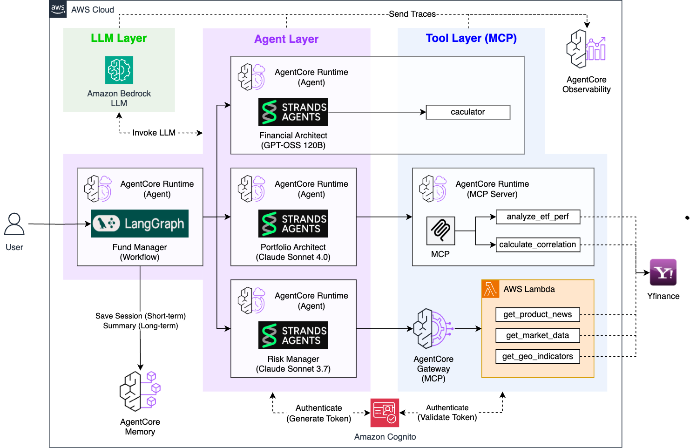

# AgenticAI Fund Manager

An intelligent, multi-agent AI system for comprehensive fund management powered by **AWS Bedrock AgentCore Runtime**. This system provides end-to-end financial analysis, portfolio design, risk management, and consultation history tracking through seamlessly integrated AI agents.

## Project Overview

AgenticAI Fund Manager is a sophisticated financial advisory system that combines four specialized AI agents working in harmony to provide complete fund management services:

### System Objectives

- **Intelligent Financial Analysis**: Assess individual financial situations and risk profiles
- **Data-Driven Portfolio Design**: Create optimized portfolios using real-time market data
- **Proactive Risk Management**: Monitor market conditions and develop mitigation strategies
- **Automated History Tracking**: Maintain permanent records of all consultations with AI-powered summarization

### Key Capabilities

**Personalized Risk Assessment** - Understand your financial profile and risk tolerance  
**Optimized Portfolio Construction** - Get 3-ETF portfolios tailored to your goals  
**Real-time Market Monitoring** - Track news, economics, and geopolitical risks  
**Scenario Planning** - Prepare for multiple economic conditions  
**Consultation History** - Maintain and track all financial consultations  
**Real-time Streaming** - Watch AI agents think and make decisions live

## System Architecture



The AgenticAI Fund Manager consists of **4 integrated AI agents** working in a coordinated workflow:

```
┌─────────────────────────────────────────────────────────────────┐
│                     USER INPUT                                  │
│  Investment amount, target return, age, experience, sectors     │
└─────────────────────────────────────────┬───────────────────────┘
                                          │
                    ┌─────────────────────▼─────────────────────┐
                    │   FUND MANAGER (Orchestrator)            │
                    │   - LangGraph Workflow Coordinator       │
                    │   - AgentCore Memory Integration         │
                    └─────────────────────┬─────────────────────┘
                    ┌───────────────────────┴───────────────────────┐
                    │                                               │
        ┌───────────▼────────────┐   ┌─────────────▼──────────┐   │
        │  STAGE 1: FINANCIAL    │   │  STAGE 2: PORTFOLIO    │   │
        │  ANALYST               │   │  ARCHITECT             │   │
        ├───────────────────────┤   ├────────────────────────┤   │
        │ • Risk Profile        │   │ • ETF Selection        │   │
        │ • Return Calculation  │   │ • Monte Carlo Analysis │   │
        │ • Sector Analysis     │   │ • Correlation Matrix   │   │
        │ • Model: GPT-OSS 120B │   │ • Allocations          │   │
        └───────────┬───────────┘   │ • Model: Claude Sonnet │   │
                    │               │ • Data: yfinance (MCP) │   │
                    │               └─────────────┬──────────┘   │
                    │                             │               │
        ┌───────────▼──────────────────────────────▼───────┐     │
        │   OUTPUT: Risk Profile + Sector Recommendations  │     │
        │   OUTPUT: Portfolio Design + Allocations        │     │
        └─────────────────────────────────────────────────┘     │
                                                                 │
                              ┌──────────────────────────────────┤
                              │                                  │
                              │    ┌──────────────┐              │
                              │    │  STAGE 3:    │              │
                              │    │  RISK        │              │
                              │    │  MANAGER     │              │
                              │    ├──────────────┤              │
                              │    │ • News       │              │
                              │    │   Analysis   │              │
                              │    │ • Market     │              │
                              │    │   Indicators │              │
                              │    │ • Geopolitics│              │
                              │    │ • Scenarios  │              │
                              │    │ • Model:     │              │
                              │    │   Claude 3.7 │              │
                              │    │ • Data:      │              │
                              │    │   Lambda+    │              │
                              │    │   yfinance   │              │
                              │    └──────┬───────┘              │
                              │           │                      │
                              │    OUTPUT: Risk Scenarios        │
                              │           + Adjustments         │
                              │                                  │
        ┌─────────────────────▼──────────────────────────────┐  │
        │      STAGE 4: COMPREHENSIVE REPORTING              │  │
        ├────────────────────────────────────────────────────┤  │
        │ • Complete Analysis Summary                         │  │
        │ • All Recommendations                              │  │
        │ • AgentCore Memory - Permanent Storage             │  │
        │ • History Tracking & Summarization                 │  │
        └─────────────────────┬───────────────────────────────┘  │
                              │                                   │
        ┌─────────────────────▼───────────────────────────────┐
        │  COMPREHENSIVE FUND MANAGEMENT REPORT              │
        │  - Financial Analysis Results                       │
        │  - Portfolio Design & Allocations                   │
        │  - Risk Scenarios & Strategies                      │
        │  - Consultation Saved to History                    │
        └──────────────────────────────────────────────────────┘
```

## Complete Workflow

### Stage 1: Financial Analysis

**Agent**: Financial Analyst (GPT-OSS 120B via AWS Bedrock)

The Financial Analyst assesses your financial profile:

- **Input**: Investment amount, target return, age, experience, sectors
- **Process**: Analyzes financial profile and calculates risk factors
- **Output**: Risk profile (Conservative/Moderate/Aggressive) + recommended sectors
- **Tools Used**: Calculator for return computations

### Stage 2: Portfolio Architecture

**Agent**: Portfolio Architect (GPT-OSS 120B via AWS Bedrock)

The Portfolio Architect designs an optimized portfolio:

- **Input**: Risk profile, target return, sector recommendations
- **Process**:
  - Selects 5 candidate ETFs from real-time market data
  - Runs 1000 Monte Carlo simulations for each
  - Calculates correlation matrix
  - Selects optimal 3 ETFs with best risk/return balance
- **Output**: Portfolio with 3 ETFs + allocation percentages + evaluation scores
- **Tools Used**: MCP Server → yfinance for real-time data, Monte Carlo simulator

### Stage 3: Risk Management

**Agent**: Risk Manager (GPT-OSS 120B via AWS Bedrock)

The Risk Manager analyzes portfolio risks:

- **Input**: Portfolio design, allocations, evaluation scores
- **Process**:
  - Collects latest news for each ETF
  - Monitors 7 macroeconomic indicators
  - Tracks 5 regional geopolitical ETFs
  - Develops 2 economic scenarios
  - Plans portfolio adjustments
- **Output**: Risk scenarios with probabilities + adjustment strategies
- **Tools Used**: Lambda functions → yfinance for news and market data

### Stage 4: Fund Management & Reporting

**Agent**: Fund Manager (LangGraph Orchestrator)

The Fund Manager coordinates all agents and manages history:

- **Input**: Complete user financial information
- **Process**:
  - Orchestrates sequential execution of all 3 agents
  - Collects all analysis results
  - Generates comprehensive report
  - Saves consultation to permanent memory
  - Maintains searchable history
- **Output**: Complete fund management report + consultation history
- **Tools Used**: AgentCore Memory with SUMMARY strategy

### Data Flow Diagram

```
Your Financial Info
    ↓ (User submits form in Streamlit)
┌───────────────────────────────────────┐
│ Fund Manager Orchestrator (LangGraph) │
└──────────┬──────────────────┬─────────┘
           │                  │
    ┌──────▼──────┐    ┌──────▼──────┐
    │ Financial   │    │ Portfolio   │ (Calls in sequence)
    │ Analyst     │    │ Architect   │
    │             │    │             │
    │ Risk Profile│    │ ETF Search  │
    │ Sectors     │───▶│ Monte Carlo │
    └──────┬──────┘    │ Correlation│
           │           └──────┬─────┘
           │                  │
           │           ┌──────▼──────┐
           │           │ Risk Manager│
           │           │             │
           │           │ News Search │
           │           │ Economics   │
           │           │ Scenarios   │
           │           └──────┬─────┘
           │                  │
           └──────┬───────────┘
                  │
           ┌──────▼────────┐
           │ AgentCore     │
           │ Memory        │
           │               │
           │ Summarize &   │
           │ Store History │
           └──────┬────────┘
                  │
           ┌──────▼────────┐
           │ Comprehensive│
           │ Report       │
           │ + History    │
           └──────────────┘
```

## Project Structure

```
AgenticAI_Fund_Manager/
├── README.md                          # This file - System overview
├── requirements.txt                   # Root dependencies
├── config.py                          # Configuration management
├── deploy_all.py                      # Deploy all agents at once
├── cleanup_all.py                     # Cleanup all resources
│
├── financial_analyst/                 # STAGE 1: Financial Analysis
│   ├── financial_analyst.py           # Agent definition
│   ├── app.py                         # Streamlit UI
│   ├── deploy.py                      # Deployment script
│   ├── requirements.txt               # Dependencies
│   ├── deployment_info.json           # Deployment metadata
│   └── README.md                      # Agent documentation
│
├── portfolio_architect/               # STAGE 2: Portfolio Design
│   ├── portfolio_architect.py         # Agent definition
│   ├── app.py                         # Streamlit UI
│   ├── deploy.py                      # Deployment script
│   ├── requirements.txt               # Dependencies
│   ├── deployment_info.json           # Deployment metadata
│   ├── README.md                      # Agent documentation
│   └── mcp_server/                    # MCP Server for data access
│       ├── server.py                  # MCP server implementation
│       ├── deploy_mcp.py              # MCP deployment
│       ├── requirements.txt
│       └── mcp_deployment_info.json
│
├── risk_manager/                      # STAGE 3: Risk Analysis
│   ├── risk_manager.py                # Agent definition
│   ├── app.py                         # Streamlit UI
│   ├── deploy.py                      # Deployment script
│   ├── requirements.txt               # Dependencies
│   ├── deployment_info.json           # Deployment metadata
│   ├── README.md                      # Agent documentation
│   ├── lambda_layer/                  # Lambda Layer for yfinance
│   │   └── deploy_lambda_layer.py
│   ├── lambda/                        # Lambda Functions
│   │   ├── lambda_function.py
│   │   └── deploy_lambda.py
│   └── gateway/                       # MCP Gateway
│       ├── target_config.py
│       └── deploy_gateway.py
│
├── fund_manager/                      # STAGE 4: Orchestration
│   ├── fund_manager.py                # LangGraph orchestrator
│   ├── app.py                         # Streamlit UI
│   ├── deploy.py                      # Deployment script
│   ├── requirements.txt               # Dependencies
│   ├── deployment_info.json           # Deployment metadata
│   ├── README.md                      # Agent documentation
│   └── agentcore_memory/              # Memory system
│       └── deploy_agentcore_memory.py
│
├── shared/                            # Shared utilities
│   ├── cognito_utils.py               # AWS Cognito utilities
│   ├── gateway_utils.py               # Gateway utilities
│   └── runtime_utils.py               # Runtime utilities
│
└── static/                            # UI assets and images
    └── *.png                          # Architecture diagrams
```

## Quick Start

### Prerequisites

- AWS Account with Bedrock access
- Python 3.8+
- AWS CLI configured

### Installation

```bash
# Clone repository
git clone repo_url
cd AgenticAI_Fund_Manager

# Install dependencies
pip install -r requirements.txt

# Configure AWS
aws configure
```

### Deployment

**Option 1: Deploy All Agents at Once**

```bash
# From root directory
python deploy_all.py
```

**Option 2: Deploy Individual Agents**

```bash
# Stage 1: Financial Analyst
cd financial_analyst && python deploy.py

# Stage 2: Portfolio Architect
cd ../portfolio_architect/mcp_server && python deploy_mcp.py
cd .. && python deploy.py

# Stage 3: Risk Manager
cd ../risk_manager/lambda_layer && python deploy_lambda_layer.py
cd ../lambda && python deploy_lambda.py
cd ../gateway && python deploy_gateway.py
cd .. && python deploy.py

# Stage 4: Fund Manager
cd ../fund_manager/agentcore_memory && python deploy_agentcore_memory.py
cd .. && python deploy.py
```

### Run the System

```bash
# Start Fund Manager (complete system)
cd fund_manager
streamlit run app.py

# Access at http://localhost:8501
```

### Or Run Individual Agents

```bash
# Run Financial Analyst
cd financial_analyst && streamlit run app.py

# Run Portfolio Architect
cd ../portfolio_architect && streamlit run app.py

# Run Risk Manager
cd ../risk_manager && streamlit run app.py
```
